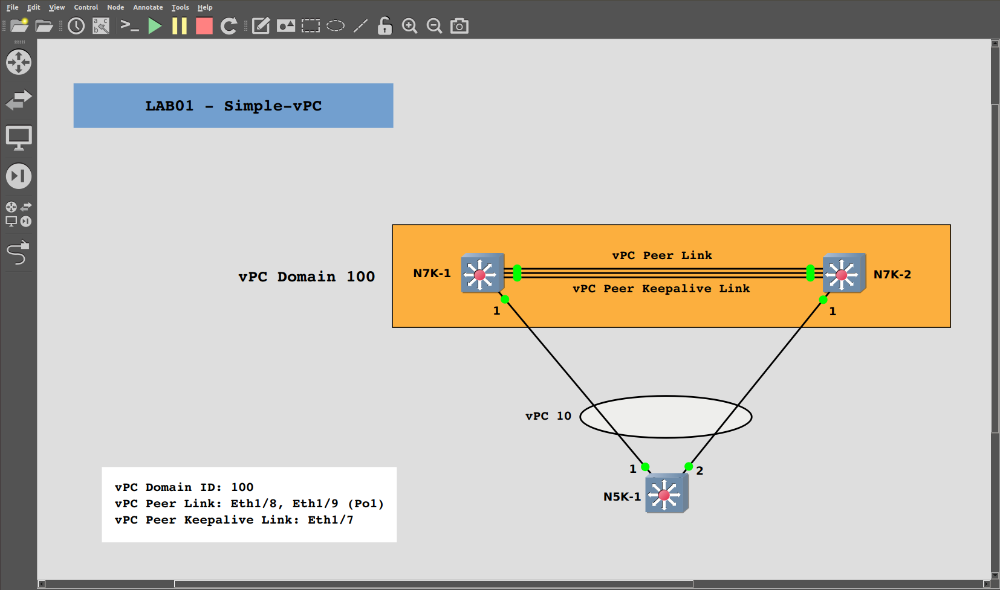

# LAB01 - Simple Virtual Port Channel

## Table of Content
- [Introduction](#Introduction)
- [Prerequisites](#Prerequisites)
- [Preparation Activities](#Preparation-Activities)
    * [GNS3 initial setup](#GNS3-initial-setup)
    * [Nexus template setup](#Nexus-template-setup)
    * [GNS3 project setup](#GNS3-project-setup)
    * [Devices setup](#Devices-setup)
- [Let's Get Started!](#Let's-Get-Started!)


---

## Introduction

Virtual Port Channel (vPC) is a feature that enables the extension of a port channel across two different physical switches. The main advantage of this feature is the possibility to configure dual-homing for downstream devices to two upstream switches, without the need for a loop control mechanism such Spanning Tree Protocol.

In this first virtual lab of the tutorial we will learn how to configure vPC in its simplest form (single-sided vPC) and to check all the status related parameters.

If you are attending a live training session, you can skip the [Preparation Activities](#Preparation-Activities) section and go directly to the [Let's Get Started!](#Let's-Get-Started!) section.

---

## Prerequisites

- Minimum RAM: 16+ GB
- Windows, MacOS or Linux
- [Download and install GNS3](https://www.gns3.com/)
- [Download NX-OSv GNS3 appliance](https://www.gns3.com/marketplace/appliance/cisco-nx-osv)
- Download appliance required software: NX-OSv version 7.3.0[^1]


[^1]: A valid Cisco account is required.

---

## Preparation Activities

The following steps show how to setup GNS3 LAB from scratch if you are using GNS3 directly on a Linux (Ubuntu 18.04) host, i.e. without GNS VM.

Currently I'm using GNS3 version 2.2.5.

> :warning: If you are using GNS3 VM some steps can be slightly different. 

### **GNS3 initial setup**

Open GNS3 and go to **File>Import appliance**. Choose the path of the downloaded appliance **cisco-nxosv.gns3a** and click Open in the top right corner. If you didn't change the path while downloading the file, you should find it under **~/Downloads/**.

Select **Install the appliance on your local computer** and press **Next** twice.
If you downloaded NX-OSv software (_titanium-final.7.3.0.D1.1.qcow2_) in the **~/Downloads/** folder, you should read **Ready to install** in the status column next to **NX-OSv version 7.3.0**. If so, select it and press **Next**, then **Ok**; otherwise press the **Import** button and select downloaded software before moving forward. Click **Finish** to complete this step.

### **Nexus template setup**

Press the **Browse switches** button. It is the icon with the parallel arrows on the left side vertical bar.

Right-click on the newly installed Nexus appliance and select **Configure template**. Under the **Network** tab, fill the _Adapters_ form with the value "16" and press the **Ok** button.

### **GNS3 project setup**

We are ready to build the following topology:



Let's create a new GNS3 project. Go to **File>New blank project** and name this project as **TrainingNexus_LAB01_Simple-vPC**, or choose the name you prefer. Press **Ok**.

Now press the **Browse switches** button and drag-and-drop 3 times the Nexus template on the workspace. Rename the devices just linke the previous image: it will be easier to follow next steps. Choose two devices to be Nexus 7K of the virtual infrastructure, and name them as **N7K-1** and **N7K-2**. The third switch will act as if it was a Nexus 5K, albeit it is simulated with a Nexus 7K image: name it **N5K-1**.

Before starting the devices we need to create the links between them. As you can see from the topology, there are 3 links between **N7K-1** and **N7K-2** and 2 links, one for each N7K-1, between **N5K-1** and the other switches. Creating a link is straightforward: push the **Add a link** button, it is the last icon on the left side vertical bar, and then click on the two devices you want to connect. Once you click on a device you have to chose the port you want to use. Please follow the connectivity scheme provided below.

|Device 1|Port 1          |Port 2          |Device 2 |Link Role               |
| :--:   |:--:            |:--:            |:--:     |:--                     |
|N7K-1   |Ethernet1/7     |Ethernet1/7     |N7K-2    |vPC Peer Keepalive Link |
|N7K-1   |Ethernet1/8     |Ethernet1/8     |N7K-2    |vPC Peer Link           |
|N7K-1   |Ethernet1/9     |Ethernet1/9     |N7K-2    |vPC Peer Link           |
|N5K-1   |Ethernet1/1     |Ethernet1/1     |N7K-1    |Uplink                  |
|N5K-1   |Ethernet1/2     |Ethernet1/1     |N7K-2    |Uplink                  |

Please don't consider the last column of the table, the meaning of that roles will be explained later on this tutorial.


### **Devices setup**

Click on the **Start/resume nodes** button, the one with the green icon on the top bar, and wait for the devices to start (~5 minutes, but it depends on host resources!). You can follow the boot process of each switch opening its console: double-click on the switch and a terminal window will pop up displaying device boot messages.

When prompted, insert the following credentials:

```
username: admin
password: admin
```

<details>
    <summary>CLI view</summary>
    <pre>
User Access Verification
 login: admin
Password: 
Last login: Thu Jan 23 14:21:17 UTC 2020 on ttyS0
</pre>
</details>

Now copy-paste the following lines on the switch CLI. We will not go into details on them because they are not in scope for this tutorial, but they could be useful in particoular if for some reason you need to restart the devices.

If you are familiar with other Cisco OSes (e.g. IOS or IOS XE ..), consider the second line: it allows you to use the shortcut "_wr_" to save the configuration during the rest of this tutorial.

```
configure terminal
cli alias name wr copy run sta
no ip domain-lookup
hostname N7K-1 
boot nxos bootflash:nxos.7.0.3.I7.3.bin
wr
!
```

> :warning: _These lines can be used as they are for the N7K-1 switch only. For the other two switches you have to customize the hostname before copy-pasting._


**Great, we are ready to start this lab!**

---

## Let's Get Started!

We need to perform 5 steps to configure a vPC:


### Enabling features 

The first thing to do when working with Nexus switches is to activate the required features. For this lab we need to enable two features: **LACP** and **VPC**.

Open the console of **N7K-1** and **N7K-2** switches, insert the credentials (_admin/admin_) and use the following commands to enable the features:

```
configure terminal
feature vpc
feature lacp
```

<details>
    <summary>CLI view</summary>
    <pre>
N7K-1# configure terminal
Enter configuration commands, one per line. End with CNTL/Z.
N7K-1(config)# feature vpc
N7K-1(config)# feature lacp
N7K-1(config)#
</pre>
</details>

These commands don't return any output. To check if the features are enabled, you can use the following commands:

```
show feature | include vpc
```

<details>
    <summary>Command Output</summary>
    <pre>
vpc                    1          enabled 
</pre>
</details>

```
show feature | include lacp
```

<details>
    <summary>Command Output</summary>
    <pre>
lacp                    1          enabled 
</pre>
</details>

As you can see from the outputs above, the features are _enabled_. If you hadn't enabled them, you would see something like that

```
N7K-1# show feature | include bgp
bgp                    1          disabled
```

### vPC Peer Keepalive Link

vPC peer keepalive link can be in any VRF, including _default_ or _mgmt_. Nevertheless, we are going to create a dedicated VRF for the peer keepalive link. On both **N7K-1** and **N7K-2** use the command

```
vrf context keepalive-link
```
to create the VRF named "_keepalive-link_".

Referring to the connectivity scheme in the [GNS3 project setup](#GNS3-project-setup) section, the port **Ethernet1/7** on **N7K-1** and **N7K-2** is used to form the vPC peer keepalive link.

#### N7K-1 Configuration

```
interface Ethernet 1/7
description *** vPC Peer Keepalive Link ***
no switchport 
vrf member keepalive-link 
ip address 10.0.100.1/30
no shutdown
```

<details>
    <summary>CLI view</summary>
    <pre>
N7K-1(config)# interface Ethernet 1/7
N7K-1(config-if)# description *** vPC Peer Keepalive Link ***
N7K-1(config-if)# no switchport 
N7K-1(config-if)# vrf member keepalive-link 
Warning: Deleted all L3 config on interface Ethernet1/7
N7K-1(config-if)# ip address 10.0.100.1/30
N7K-1(config-if)# no shutdown
</pre>
</details>

Syntax description:
|Command                                    |Purpose                                                        |
| :--                                       |:--                                                            |
|interface Ethernet 1/7                     |Enters interface Ethernet1/7 configuration mode.               |
|description *** vPC Peer Keepalive Link ***|Sets interface description.                                    |
|no switchport                              |Configures the interface as a Layer3 interface.                |
|vrf member keepalive-link                  |Adds this interface to the "keepalive-link" VRF.               |
|ip address 10.0.100.1/30                   |Configures the IP address 10.0.100.1/30 for this interface.    |
|no shutdown                                |Turns on this interface.                                       |

#### N7K-2 Configuration & Link Verification

```
interface Ethernet 1/7
description *** vPC Peer Keepalive Link ***
no switchport 
vrf member keepalive-link 
ip address 10.0.100.2/30
no shutdown
```

<details>
    <summary>CLI view</summary>
    <pre>
N7K-2(config)# interface Ethernet 1/7
N7K-2(config-if)# description *** vPC Peer Keepalive Link ***
N7K-2(config-if)# no switchport 
N7K-2(config-if)# vrf member keepalive-link 
Warning: Deleted all L3 config on interface Ethernet1/7
N7K-2(config-if)# ip address 10.0.100.2/30
N7K-2(config-if)# no shutdown
</pre>
</details>

As you can see from the commands above, the configuration is almost the same as the the one for the **N7K-1** switch. The only difference is the IP address assigned to the interface Ethernet1/7.
You can choose the IP subnet you prefer for the L3 connectivity on the peer keepalive link: just make sure to assign two different IP addresses in the same subnet to the link ends.

Let's check L3 connectivity on the peer keepalive link. On **N7K-2** use the command:

```
ping 10.0.100.1 vrf keepalive-link
```

<details>
    <summary>Command Output</summary>
    <pre>
PING 10.0.100.1 (10.0.100.1): 56 data bytes
64 bytes from 10.0.100.1: icmp_seq=0 ttl=254 time=21.111 ms
64 bytes from 10.0.100.1: icmp_seq=1 ttl=254 time=3.015 ms
64 bytes from 10.0.100.1: icmp_seq=2 ttl=254 time=4.98 ms
64 bytes from 10.0.100.1: icmp_seq=3 ttl=254 time=5.842 ms
64 bytes from 10.0.100.1: icmp_seq=4 ttl=254 time=3.371 ms
^C
--- 10.0.100.1 ping statistics ---
5 packets transmitted, 5 packets received, 0.00% packet loss
round-trip min/avg/max = 3.015/7.663/21.111 ms
</pre>
</details>

>
>If your output is similar to the one above you are fine, otherwise look for typos in the configurations with some _show_ command, e.g.>
>
>```
>show run interface Ethernet1/7
>```
>or verify the interface operational status
>```
>show ip interface brief vrf keepalive-link
>```
>

Now, let's create the vPC Domain _100_ on both **N7K-1** and **N7K-2**:

#### N7K-1 Configuration

```
vpc domain 100
peer-keepalive destination 10.0.100.2 source 10.0.100.1 vrf keepalive-link
```
<details>
<summary>CLI view</summary>
<pre>
N7K-1(config)# vpc domain 100
2020 Jan 23 15:19:53 N7K-1 %$ VDC-1 %$ %STP-2-VPC_PEERSWITCH_CONFIG_DISABLED: vPC peer-switch configuration is disabled. Please make sure to change spanning tree "bridge" priority as per the recommended guidelines.

N7K-1(config-vpc-domain)# peer-keepalive destination 10.0.100.2 source 10.0.100.1 vrf keepalive-link 
N7K-1(config-vpc-domain)#
</pre>
</details>

#### N7K-2 Configuration

```
vpc domain 100
peer-keepalive destination 10.0.100.1 source 10.0.100.2 vrf keepalive-link
```
<details>
<summary>CLI view</summary>
<pre>
N7K-2(config)# vpc domain 100
2020 Jan 24 09:01:27 N7K-2 %$ VDC-1 %$ %STP-2-VPC_PEERSWITCH_CONFIG_DISABLED: vPC peer-switch configuration is disabled. Please make sure to change spanning tree "bridge" priority as per the recommended guidelines.
N7K-2(config-vpc-domain)# peer-keepalive destination 10.0.100.1 source 10.0.100.2 vrf keepalive-link
N7K-2(config-vpc-domain)#
</pre>
</details>

