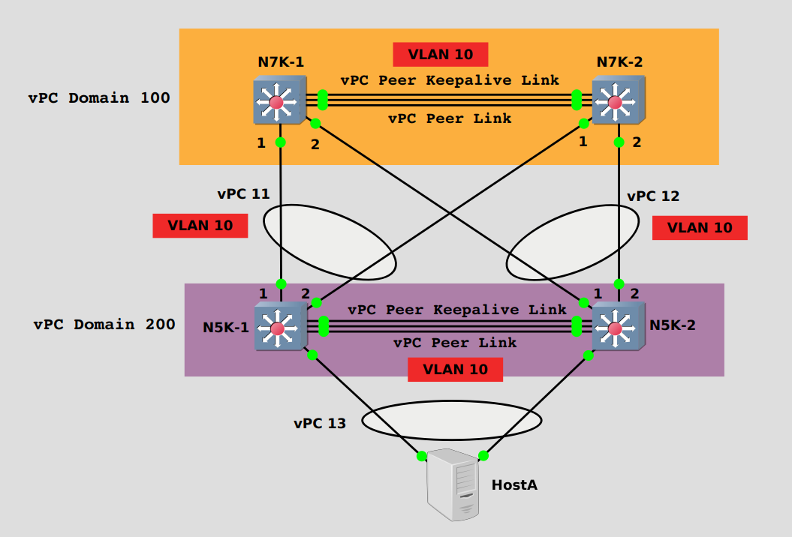

# LAB02 - Dual-Sided Virtual Port Channel

## Table of Content
- [Introduction](#Introduction)
- [Prerequisites](#Prerequisites)
- [Preparation Activities](#Preparation-Activities)
    * [GNS3 initial setup](#GNS3-initial-setup)
    * [Nexus template setup](#Nexus-template-setup)
    * [GNS3 project setup](#GNS3-project-setup)
    * [Devices setup](#Devices-setup)
- [Virtual Port Channel Configuration (N7K Side)](#Virtual-Port-Channel-Configuration-(N7K-Side))
    * [Enable features](#Enable-features)
    * [vPC Peer Keepalive Link preconfig](#vPC-Peer-Keepalive-Link-preconfig)
    * [vPC Domain](#vPC-Domain)
    * [vPC Peer Link](#vPC-Peer-Link)
    * [vPC creation](#vPC-creation)
- [Virtual Port Channel Configuration (N5K Side)](#Virtual-Port-Channel-Configuration-(N5K-Side))
- [Conclusions](#Conclusions)


## Introduction

Often times, you find datacenter architectures that support multiple access Nexus switches (e.g. Nexus 5000 Series) to increase the resiliency of the network. Implementing vPC on the N5K switches toward access devices, you can take advantage of increased bandwidth and active-active multi-homing configuration without any operational drawback (on the access side).

If both access switches (aka _leaves_), in vPC configuration, are connected by means of a different vPC to two aggregation switch (the N7K switches, aka _spines_), probably you would need a protocol like STP to manage the loops on the VLANs running on this infrastructure.

This is a case in which an image worths thousand words:



The previous image shows the topology of this LAB. It is also showed what are the links that carries the VLAN 10. Can you see the "problem" of this configuration? There is a loop on that VLAN because it is propagated on all the links (as it should be!). This means that you need STP, and that there is a link in **BLK** state (for VLAN 10) because of STP loop prevention mechanism.

Starting from this scenario, we will see in this LAB how to improve the configuration so that there are no possible loops. In particular, we will modify the configuration to implement a Dual-Sided vPC between the **N5Ks** and **N7Ks** switches to solve the issue of STP blocking the ports.

If you are attending a live training session, you go can go directly to the next section, otherwise, if you need to build the virtual LAB from scratch, please check the "**Preparation Activities**" section of the [previous LAB](../LAB01/LAB01_instruction.md).

---

## Present Configuration Inspection


## Dual-Sided vPC Configuration (N7K Side)

We need to perform 5 steps to configure a vPC

- [ ] Enable features
- [ ] vPC Peer Keepalive Link preconfig
- [ ] vPC Domain
- [ ] vPC Peer Link
- [ ] vPC creation


### **Enable features** 

The first thing to do when working with Nexus switches is to activate the required features. For this lab we need to enable two features: **LACP** and **VPC**.

Open the console of **N7K-1** and **N7K-2** switches, insert the credentials (_admin/admin_) and use the following commands to enable the features:

```
configure terminal
feature vpc
feature lacp
```

<details>
    <summary>CLI view</summary>
    <pre>
N7K-1# configure terminal
Enter configuration commands, one per line. End with CNTL/Z.
N7K-1(config)# feature vpc
N7K-1(config)# feature lacp
N7K-1(config)#
</pre>
</details>

These commands don't return any output. To check if the features are enabled, you can use the following commands:

```
show feature | include vpc
```

<details>
    <summary>Command Output</summary>
    <pre>
vpc                    1          enabled 
</pre>
</details>

```
show feature | include lacp
```

<details>
    <summary>Command Output</summary>
    <pre>
lacp                    1          enabled 
</pre>
</details>

As you can see from the outputs above, the features are _enabled_. If you hadn't enabled them, you would see something like that

```
N7K-1# show feature | include bgp
bgp                    1          disabled
```
> :heavy_check_mark: Well done! Step completed successfully!
> ---
> **_Progress Map_**
>- [x] Enable features
>- [ ] vPC Peer Keepalive Link preconfig
>- [ ] vPC Domain
>- [ ] vPC Peer Link
>- [ ] vPC creation
>
> ---

### **vPC Peer Keepalive Link preconfig**

vPC peer keepalive link can be in any VRF, including _default_ or _mgmt_. Nevertheless, we are going to create a dedicated VRF for the peer keepalive link. On both **N7K-1** and **N7K-2** use the command

```
vrf context keepalive-link
```
to create the VRF named "_keepalive-link_".

Referring to the connectivity scheme in the [GNS3 project setup](#GNS3-project-setup) section, the port **Ethernet1/7** on **N7K-1** and **N7K-2** is used to form the vPC peer keepalive link.

#### N7K-1 Configuration

```
interface Ethernet 1/7
description *** vPC Peer Keepalive Link ***
no switchport 
vrf member keepalive-link 
ip address 10.0.100.1/30
no shutdown
```

<details>
    <summary>CLI view</summary>
    <pre>
N7K-1(config)# interface Ethernet 1/7
N7K-1(config-if)# description *** vPC Peer Keepalive Link ***
N7K-1(config-if)# no switchport 
N7K-1(config-if)# vrf member keepalive-link 
Warning: Deleted all L3 config on interface Ethernet1/7
N7K-1(config-if)# ip address 10.0.100.1/30
N7K-1(config-if)# no shutdown
</pre>
</details>

Syntax description:

|Command                                     |Purpose                                                        |
| :--                                        |:--                                                            |
|interface Ethernet 1/7                      |Enters interface Ethernet1/7 configuration mode.               |
|description \*** vPC Peer Keepalive Link ***|Sets interface description.                                    |
|no switchport                               |Configures the interface as a Layer3 interface.                |
|vrf member keepalive-link                   |Adds this interface to the "keepalive-link" VRF.               |
|ip address 10.0.100.1/30                    |Configures the IP address 10.0.100.1/30 for this interface.    |
|no shutdown                                 |Turns on this interface.                                       |

#### N7K-2 Configuration & Link Verification

```
interface Ethernet 1/7
description *** vPC Peer Keepalive Link ***
no switchport 
vrf member keepalive-link 
ip address 10.0.100.2/30
no shutdown
```

<details>
    <summary>CLI view</summary>
    <pre>
N7K-2(config)# interface Ethernet 1/7
N7K-2(config-if)# description *** vPC Peer Keepalive Link ***
N7K-2(config-if)# no switchport 
N7K-2(config-if)# vrf member keepalive-link 
Warning: Deleted all L3 config on interface Ethernet1/7
N7K-2(config-if)# ip address 10.0.100.2/30
N7K-2(config-if)# no shutdown
</pre>
</details>

As you can see from the commands above, the configuration is almost the same as the the one for the **N7K-1** switch. The only difference is the IP address assigned to the interface Ethernet1/7.
You can choose the IP subnet you prefer for the L3 connectivity on the peer keepalive link: just make sure to assign two different IP addresses in the same subnet to the link ends.

Let's check L3 connectivity on the peer keepalive link. On **N7K-2** use the command:

```
ping 10.0.100.1 vrf keepalive-link
```

<details>
    <summary>Command Output</summary>
    <pre>
PING 10.0.100.1 (10.0.100.1): 56 data bytes
64 bytes from 10.0.100.1: icmp_seq=0 ttl=254 time=21.111 ms
64 bytes from 10.0.100.1: icmp_seq=1 ttl=254 time=3.015 ms
64 bytes from 10.0.100.1: icmp_seq=2 ttl=254 time=4.98 ms
64 bytes from 10.0.100.1: icmp_seq=3 ttl=254 time=5.842 ms
64 bytes from 10.0.100.1: icmp_seq=4 ttl=254 time=3.371 ms
^C
--- 10.0.100.1 ping statistics ---
5 packets transmitted, 5 packets received, 0.00% packet loss
round-trip min/avg/max = 3.015/7.663/21.111 ms
</pre>
</details>


If your output is similar to the one above you are fine, otherwise look for typos in the configurations with some _show_ command, e.g.>

```
show run interface Ethernet1/7
```
or verify the interface operational status
```
show ip interface brief vrf keepalive-link
```
> :heavy_check_mark: Well done! Step completed successfully!
>---
> **_Progress Map_**
>- [x] Enable features
>- [x] vPC Peer Keepalive Link preconfig
>- [ ] vPC Domain
>- [ ] vPC Peer Link
>- [ ] vPC creation
> ---

### **vPC Domain**

Now, let's create the vPC Domain _100_ on both **N7K-1** and **N7K-2**:

#### N7K-1 Configuration

```
vpc domain 100
peer-keepalive destination 10.0.100.2 source 10.0.100.1 vrf keepalive-link
```
<details>
<summary>CLI view</summary>
<pre>
N7K-1(config)# vpc domain 100
2020 Jan 23 15:19:53 N7K-1 %$ VDC-1 %$ %STP-2-VPC_PEERSWITCH_CONFIG_DISABLED: vPC peer-switch configuration is disabled. Please make sure to change spanning tree "bridge" priority as per the recommended guidelines.

N7K-1(config-vpc-domain)# peer-keepalive destination 10.0.100.2 source 10.0.100.1 vrf keepalive-link 
N7K-1(config-vpc-domain)#
</pre>
</details>

#### N7K-2 Configuration

```
vpc domain 100
peer-keepalive destination 10.0.100.1 source 10.0.100.2 vrf keepalive-link
```
<details>
<summary>CLI view</summary>
<pre>
N7K-2(config)# vpc domain 100
2020 Jan 24 09:01:27 N7K-2 %$ VDC-1 %$ %STP-2-VPC_PEERSWITCH_CONFIG_DISABLED: vPC peer-switch configuration is disabled. Please make sure to change spanning tree "bridge" priority as per the recommended guidelines.
N7K-2(config-vpc-domain)# peer-keepalive destination 10.0.100.1 source 10.0.100.2 vrf keepalive-link
N7K-2(config-vpc-domain)#
</pre>
</details>

> :heavy_check_mark: Well done! Step completed successfully!
>---
> **_Progress Map_**
>- [x] Enable features
>- [x] vPC Peer Keepalive Link preconfig
>- [x] vPC Domain
>- [ ] vPC Peer Link
>- [ ] vPC creation
> ---

### **vPC Peer Link**

One more piece of configuration has to be completed before actually creating the vPC: the vPC Peer Link.

To create the vPC Peer Link, we have to aggregate at least two 10G interfaces on each switch that is part of the vPC Domain. Referring to the connectivity scheme in the [GNS3 project setup](#GNS3-project-setup) section, the ports **Ethernet1/8** and **Ethernet1/9** on both **N7K-1** and **N7K-2** are used to form the vPC peer link. Use the following commands on both **N7K-1** and **N7K-2**:

```
interface Ethernet 1/8-9
switchport 
channel-group 1 mode active 
interface port-channel 1
description *** vPC Peer Link ***
switchport
switchport mode trunk 
vpc peer-link
no shutdown 
```

<details>
<summary>CLI view</summary>
<pre>
N7K-1(config)# interface Ethernet 1/8-9
N7K-1(config-if-range)# switchport 
N7K-1(config-if-range)# channel-group 1 mode active 
N7K-1(config-if-range)# interface port-channel 1
N7K-1(config-if)# description *** vPC Peer Link ***
N7K-1(config-if)# switchport 
N7K-1(config-if)# switchport mode trunk 
N7K-1(config-if)# vpc peer-link 
2020 Jan 23 15:23:05 N7K-1 %$ VDC-1 %$ stp: Please note that spanning tree port type is changed to "network" port type on vPC peer-link. This will enable spanning tree Bridge Assurance on vPC peer-link provided the STP Bridge Assurance (which is enabled by default) is not disabled.
N7K-1(config-if)# no shutdown 
</pre>
</details>

Syntax description:

|Command                                    |Purpose                                                        |
|:--                                        |:--                                                            |
|interface Ethernet 1/8-9                   |Specifies the interface that you are configuring.              |
|switchport                                 |Configures the interfaces as a Layer2 interface.               |
|channel-group 1 mode active                |Configures the ports in the channel group _1_ and sets the mode _active_ (LACP protocol)               |
|no shutdown                                |Turns on these interfaces.                                     |
|interface port-channel 1                   |Enters the interface port-channel1 configuration mode.         |
|description \*** vPC Peer Link ***         |Sets interface description.                                    |
|switchport mode trunk                      |Configures the interface as a Layer 2 trunk port.              |
|vpc peer-link                              |Configures the selected port channel as the vPC peer link.     |

To see the operational status of the port-channel and its interface members, use the following command:

```
show port-channel summary
```

<details>
<summary>Command Output</summary>
<pre>
Flags:  D - Down        P - Up in port-channel (members)
        I - Individual  H - Hot-standby (LACP only)
        s - Suspended   r - Module-removed
        b - BFD Session Wait
        S - Switched    R - Routed
        U - Up (port-channel)
        p - Up in delay-lacp mode (member)
        M - Not in use. Min-links not met
--------------------------------------------------------------------------------
Group Port-       Type     Protocol  Member Ports
      Channel
--------------------------------------------------------------------------------
1     Po1(SU)     Eth      LACP      Eth1/8(P)    Eth1/9(P) 
</pre>
</details>

The expected port-channel state is **SU**, i.e. _Switched_ and _Up_. If you see a different code next to _Po1_, something was not configured properly and you need to look for errors in the configuration. If you are completely sure that the commands are correct, turn off and then turn back on the port-channel member interfaces, like this:

```
interface Ethernet1/8-9
shutdown
no shutdown
```
> :heavy_check_mark: Well done! Step completed successfully!
> ---
> **_Progress Map_**
>- [x] Enable features
>- [x] vPC Peer Keepalive Link preconfig
>- [x] vPC Domain
>- [x] vPC Peer Link
>- [ ] vPC creation
> ---

### **vPC creation**

In this final step we have to assign two interfaces, one for each Nexus 7K switch, to the port-channel that sees the Nexus **N5K-1** at the other end. This port-channel will be our vPC. That means that even if the two member interfaces reside on two different devices, they will be part of the same link aggregation group thanks to the previous configuration steps.

On both **N7K-1** and **N7K-2** use use the following commands to configure the vPC. The interfaces are defined in the connectivity scheme of the [GNS3 project setup](#GNS3-project-setup) section.

```
interface Ethernet 1/1
description *** vPC 10 ***
switchport 
channel-group 10 mode active
no shutdown
interface port-channel 10
switchport mode trunk 
vpc 10
```

<details>
<summary>CLI view</summary>
<pre>
N7K-1(config)# interface Ethernet 1/1
N7K-1(config-if)# description *** vPC 10 ***
N7K-1(config-if)# switchport 
N7K-1(config-if)# channel-group 10 mode active
N7K-1(config-if)# no shutdown
N7K-1(config-if)# interface port-channel 10
N7K-1(config-if)# switchport mode trunk 
N7K-1(config-if)# vpc 10
N7K-1(config-if)#
</pre>
</details>

Now that we have finally completed the vPC configuration (on N7K side...), we can check if all the main parameters are properly set or if there is something in an unexpected or inconsitent status between the vPC peers.

For the purpose of this LAB, please use the following commands to inspect the operational state of the vPC:

|Command                               |Description                         |
|:--                                   |:--                                 |
|show running-config vpc               |Shows the running configuration for all vPCs.|
|show vpc brief                        |Displays brief information about all vPCs.|
|show vpc peer-keepalive               |Displays information about the keepalive messages of vPC.|

Please find below the expected outputs.

#### show running-config vpc

<details>
<summary>CLI view</summary>
<pre>
N7K-1# show running-config vpc

!Command: show running-config vpc
!Time: Fri Jan 24 13:09:22 2020

version 7.0(3)I7(3)
feature vpc

vpc domain 100
  peer-keepalive destination 10.0.100.2 source 10.0.100.1 vrf keepalive-link

interface port-channel1
  vpc peer-link

interface port-channel10
  vpc 10

!!!!!!!!!!!!!!!!!!!!!!!!!!!!!!!!!!!!!!!!!!!!!!!!!!!!!!!!!!!!!!!!!!!!!!!!!!!!!

N7K-2# show running-config vpc

!Command: show running-config vpc
!Time: Fri Jan 24 13:14:00 2020

version 7.0(3)I7(3)
feature vpc

vpc domain 100
  peer-keepalive destination 10.0.100.1 source 10.0.100.2 vrf keepalive-link

interface port-channel1
  vpc peer-link

interface port-channel10
  vpc 10
</pre>
</details>

#### show vpc brief

<details>
<summary>CLI view</summary>
<pre>
N7K-1# show vpc brief
Legend:
                (*) - local vPC is down, forwarding via vPC peer-link

vPC domain id                     : 100 
Peer status                       : peer adjacency formed ok      
vPC keep-alive status             : peer is alive                 
Configuration consistency status  : success 
Per-vlan consistency status       : success                       
Type-2 consistency status         : success 
vPC role                          : primary                       
Number of vPCs configured         : 1   
Peer Gateway                      : Disabled
Dual-active excluded VLANs        : -
Graceful Consistency Check        : Enabled
Auto-recovery status              : Disabled
Delay-restore status              : Timer is off.(timeout = 30s)
Delay-restore SVI status          : Timer is off.(timeout = 10s)
Operational Layer3 Peer-router    : Disabled

vPC Peer-link status
\---------------------------------------------------------------------
id    Port   Status Active vlans    
\--    ----   ------ -------------------------------------------------
1     Po1    up     1                                                           
         

vPC status
\----------------------------------------------------------------------------
Id    Port          Status Consistency Reason                Active vlans
--    ------------  ------ ----------- ------                ---------------
10    Po10          down*  success     success               -   

!!!!!!!!!!!!!!!!!!!!!!!!!!!!!!!!!!!!!!!!!!!!!!!!!!!!!!!!!!!!!!!!!!!!!!!!!!!!!

N7K-2# show vpc brief
Legend:
                (*) - local vPC is down, forwarding via vPC peer-link

vPC domain id                     : 100 
Peer status                       : peer adjacency formed ok      
vPC keep-alive status             : peer is alive                 
Configuration consistency status  : success 
Per-vlan consistency status       : success                       
Type-2 consistency status         : success 
vPC role                          : secondary                     
Number of vPCs configured         : 1   
Peer Gateway                      : Disabled
Dual-active excluded VLANs        : -
Graceful Consistency Check        : Enabled
Auto-recovery status              : Disabled
Delay-restore status              : Timer is off.(timeout = 30s)
Delay-restore SVI status          : Timer is off.(timeout = 10s)
Operational Layer3 Peer-router    : Disabled

vPC Peer-link status
\---------------------------------------------------------------------
id    Port   Status Active vlans    
\--    ----   ------ -------------------------------------------------
1     Po1    up     1                                                           
         

vPC status
\----------------------------------------------------------------------------
Id    Port          Status Consistency Reason                Active vlans
--    ------------  ------ ----------- ------                ---------------
10    Po10          down*  success     success               -   
</pre>
</details>

#### show vpc peer-keepalive

<details>
<summary>CLI view</summary>
<pre>

N7K-1# show vpc peer-keepalive 

vPC keep-alive status             : peer is alive                 
--Peer is alive for             : (15915) seconds, (159) msec
--Send status                   : Success 
--Last send at                  : 2020.01.24 13:26:45 596 ms
--Sent on interface             : Eth1/7
--Receive status                : Success
--Last receive at               : 2020.01.24 13:26:45 602 ms
--Received on interface         : Eth1/7
--Last update from peer         : (0) seconds, (282) msec

vPC Keep-alive parameters
--Destination                   : 10.0.100.2
--Keepalive interval            : 1000 msec
--Keepalive timeout             : 5 seconds
--Keepalive hold timeout        : 3 seconds
--Keepalive vrf                 : keepalive-link
--Keepalive udp port            : 3200
--Keepalive tos                 : 192

!!!!!!!!!!!!!!!!!!!!!!!!!!!!!!!!!!!!!!!!!!!!!!!!!!!!!!!!!!!!!!!

N7K-2# show vpc peer-keepalive 

vPC keep-alive status             : peer is alive                 
--Peer is alive for             : (15948) seconds, (469) msec
--Send status                   : Success 
--Last send at                  : 2020.01.24 13:27:17 811 ms
--Sent on interface             : Eth1/7
--Receive status                : Success
--Last receive at               : 2020.01.24 13:27:17 816 ms
--Received on interface         : Eth1/7
--Last update from peer         : (0) seconds, (577) msec

vPC Keep-alive parameters
--Destination                   : 10.0.100.1
--Keepalive interval            : 1000 msec
--Keepalive timeout             : 5 seconds
--Keepalive hold timeout        : 3 seconds
--Keepalive vrf                 : keepalive-link
--Keepalive udp port            : 3200
--Keepalive tos                 : 192

</pre>
</details>

> :heavy_check_mark: Well done! Step completed successfully!
> ---
> **_Progress Map_**
>- [x] Enable features
>- [x] vPC Peer Keepalive Link preconfig
>- [x] vPC Domain
>- [x] vPC Peer Link
>- [x] vPC creation
> ---

## Virtual Port Channel Configuration (N5K Side)

Honestly, the title of this section is absolutely misleading.

There is not any "_vPC configuration_" on the N5K side, because in this lab we are configuring a single-sided vPC, and this means that only on the N7K switches side there are some "special" settings, while on the N5K side the vPC is equal to an old-fashioned port-channel.

Nevertheless, the architectural scenario of all these three switches is a vPC, even if on one side the vPC configuration collapses on the port-channel configuration.

To complete this short section you have to aggregate the two interfaces **Ethernet1/1** and **Ethernet1/2** on the **N5K-1** in a port-channel.

This activity has only 2 steps:

- Enable LACP feature
- Create port-channel

We already did both of these steps during the vPC configuration on N7K side, no further details are needed.

Before configuring this port-channel, notice that in  [this output](#show-vpc-brief) the vPC status is **_down\*_**: that's because that interface does not see any LACP BPDU coming from the link.

Use the followings to configure the port-channel on **N5K-1**:

```
configure terminal 
feature lacp
interface Ethernet 1/1-2
switchport 
channel-group 10 mode active
no shutdown 
interface port-channel 10
description *** vPC 10 ***
switchport mode trunk 
```
<details>
<summary>CLI view</summary>
<pre>
N5K-1# configure terminal 
Enter configuration commands, one per line. End with CNTL/Z.
N5K-1(config)# feature lacp
N5K-1(config)# interface Ethernet 1/1-2
N5K-1(config-if-range)# switchport 
N5K-1(config-if-range)# channel-group 10 mode active
N5K-1(config-if-range)# no shutdown 
N5K-1(config-if-range)# interface port-channel 10
N5K-1(config-if)# description *** vPC 10 ***
N5K-1(config-if)# switchport mode trunk
N5K-1(config-if)#
</pre>
</details>

Run again the command _show vpc brief_ on the **N7K-1** or on the **N7K-2**: now you should be able to see the vPC status as **_up_**:

```
show vpc brief
```

<details>
<summary>CLI view</summary>
<pre>
N7K-1# show vpc brief
Legend:
                (*) - local vPC is down, forwarding via vPC peer-link

vPC domain id                     : 100 
Peer status                       : peer adjacency formed ok      
vPC keep-alive status             : peer is alive                 
Configuration consistency status  : success 
Per-vlan consistency status       : success                       
Type-2 consistency status         : success 
vPC role                          : primary                       
Number of vPCs configured         : 1   
Peer Gateway                      : Disabled
Dual-active excluded VLANs        : -
Graceful Consistency Check        : Enabled
Auto-recovery status              : Disabled
Delay-restore status              : Timer is off.(timeout = 30s)
Delay-restore SVI status          : Timer is off.(timeout = 10s)
Operational Layer3 Peer-router    : Disabled

vPC Peer-link status
\---------------------------------------------------------------------
id    Port   Status Active vlans    
\--    ----   ------ -------------------------------------------------
1     Po1    up     1                                                           
         

vPC status
\----------------------------------------------------------------------------
Id    Port          Status Consistency Reason                Active vlans
\--    ------------  ------ ----------- ------                ---------------
10    Po10          up     success     success               1            
</pre>
</details>

## Conclusions

:+1: Congratulations! You just completed this LAB!
---

In this LAB we learnt **how to**:

- set up the required softwares to build up the virtual environment;
- configure a single-sided Virtual Port Channel between two Nexus 7K and a Nexus 5K

In the [next LAB](../LAB02/LAB02_instruction.md) we will see how to configure a dual-sided Virtual Port Channels, so as to take full advantage of the vPC feature.
