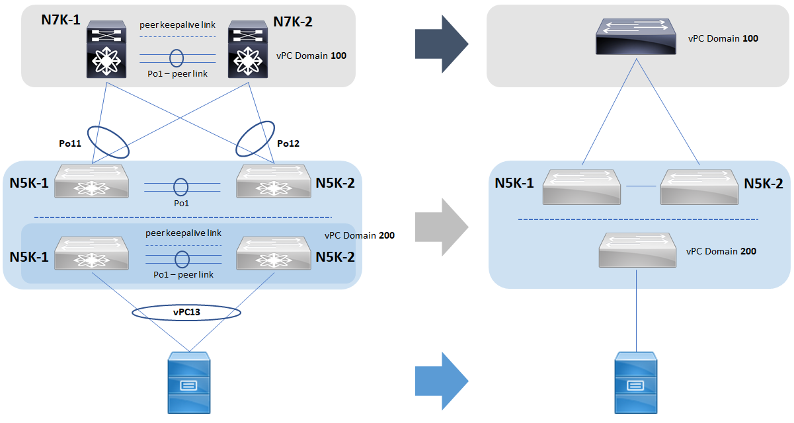
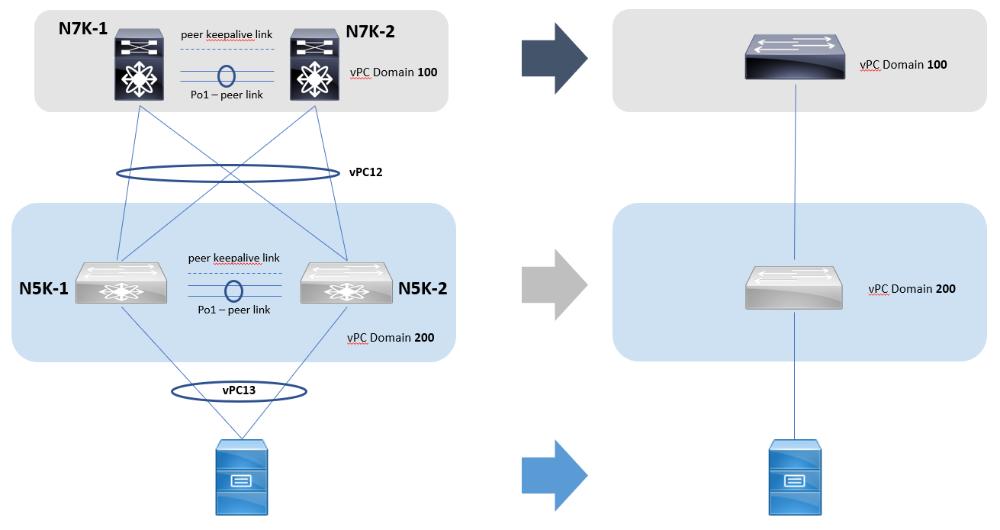

# LAB02 - Dual-Sided Virtual Port Channel

## Table of Content
- [Introduction](#Introduction)
- [Present Configuration Inspection](#Present-Configuration-Inspection)
    * [Connectivity Scheme](#Connectivity-Scheme)
    * [Spanning-Tree (VLAN10) Analysis](#Spanning-Tree-(VLAN10)-Analysis)
- [Dual-Sided vPC Configuration](#Dual-Sided-vPC-Configuration)
    * [...and so what?](#...and-so-what?)
    * [Remove interfaces from Po11 and add them to Po12 on both N7Ks](#Remove-interfaces-from-Po11-and-add-them-to-Po12-on-both-N7Ks)
    * [Configure Po11 (N5K-1) and Po12 (N5K-2) as vPC12](#Configure-Po11-(N5K-1)-and-Po12-(N5K-2)-as-vPC12)
- [Final Considerations](#Final-Considerations)
- [Conclusions](#Conclusions)


## Introduction

Often times, you find datacenter architectures that support multiple access Nexus switches (e.g. Nexus 5000 Series) to increase the resiliency of the network. Implementing vPC on the N5K switches toward access devices, you can take advantage of increased bandwidth and active-active multi-homing configuration without any operational drawback (on the access side).

If both access switches (aka _leaves_), in vPC configuration, are connected by means of a different vPC to two aggregation switch (the N7K switches, aka _spines_), probably you would need a protocol like STP to manage the loops on the VLANs running on this infrastructure.

This is a case in which an image worths thousand words:


The previous image shows the topology of this LAB. It is also showed what are the links that carries the VLAN 10. Can you see the "problem" of this configuration? There is a loop on that VLAN because it is propagated on all the links (as it should be!). This means that you need STP, and that there is a link in **BLK** state (for VLAN 10) because of STP loop prevention mechanism.

Starting from this scenario, we will see in this LAB how to improve the configuration so that there are no possible loops. In particular, we will modify the configuration to implement a Dual-Sided vPC between the **N5Ks** and **N7Ks** switches to solve the issue of STP blocking the ports.

If you are attending a live training session, you go can go directly to the next section, otherwise, if you need to build the virtual LAB from scratch, please check the "**Preparation Activities**" section of the [previous LAB](../LAB01/LAB01_instruction.md) and adapt it to build the topology represented in the previous image.

---

## Present Configuration Inspection

Devices in this LAB have already been configured to support the scenario presented in the previous section. In this section you can find some more physical and logical configuration details.

### Connectivity Scheme

|Device 1|Port 1          |Port 2          |Device 2 |Link Role               |
| :--:   |:--:            |:--:            |:--:     |:--                     |
|N7K-1   |Ethernet1/7     |Ethernet1/7     |N7K-2    |vPC Peer Keepalive Link - vPC Domain100|
|N7K-1   |Ethernet1/8     |Ethernet1/8     |N7K-2    |vPC Peer Link - vPC Domain100|
|N7K-1   |Ethernet1/9     |Ethernet1/9     |N7K-2    |vPC Peer Link - vPC Domain100|
|N5K-1   |Ethernet1/7     |Ethernet1/7     |N5K-2    |vPC Peer Keepalive Link - vPC Domain200|
|N5K-1   |Ethernet1/8     |Ethernet1/8     |N5K-2    |vPC Peer Link - vPC Domain200|
|N5K-1   |Ethernet1/9     |Ethernet1/9     |N5K-2    |vPC Peer Link - vPC Domain200|
|N5K-1   |Ethernet1/1     |Ethernet1/1     |N7K-1    |Uplink - vPC11          |
|N5K-1   |Ethernet1/2     |Ethernet1/1     |N7K-2    |Uplink - vPC11          |
|N5K-1   |Ethernet1/3     |GigabitEth1/0   |HostA    |Downlink - vPC13        |
|N5K-2   |Ethernet1/1     |Ethernet1/2     |N7K-1    |Uplink - vPC12          |
|N5K-2   |Ethernet1/2     |Ethernet1/2     |N7K-2    |Uplink - vPC12          |
|N5K-2   |Ethernet1/3     |GigabitEth2/0   |HostA    |Downlink - vPC13        |

### Spanning-Tree (VLAN10) Analysis

Let's check the STP operational status of ports assigned to VLAN10 on these four switches. Run the following command on all devices:

```
show spanning-tree vlan 10
```

<details>
    <summary>N7K-1 Command Output</summary>
    <pre>

VLAN0010
  Spanning tree enabled protocol rstp
  Root ID    Priority    8202
             Address     0023.04ee.be64
             This bridge is the root
             Hello Time  2  sec  Max Age 20 sec  Forward Delay 15 sec

  Bridge ID  Priority    8202   (priority 8192 sys-id-ext 10)
             Address     0023.04ee.be64
             Hello Time  2  sec  Max Age 20 sec  Forward Delay 15 sec

Interface        Role Sts Cost      Prio.Nbr Type
---------------- ---- --- --------- -------- --------------------------------
Po1              Root FWD 3         128.4096 (vPC peer-link) Network P2p 
Po11             Desg FWD 1         128.4106 (vPC) P2p 
Po12             Desg FWD 1         128.4107 (vPC) P2p 

</pre>
</details>

<details>
    <summary>N7K-2 Command Output</summary>
    <pre>

VLAN0010
  Spanning tree enabled protocol rstp
  Root ID    Priority    8202
             Address     0023.04ee.be64
             This bridge is the root
             Hello Time  2  sec  Max Age 20 sec  Forward Delay 15 sec

  Bridge ID  Priority    8202   (priority 8192 sys-id-ext 10)
             Address     0023.04ee.be64
             Hello Time  2  sec  Max Age 20 sec  Forward Delay 15 sec

Interface        Role Sts Cost      Prio.Nbr Type
---------------- ---- --- --------- -------- --------------------------------
Po1              Desg FWD 3         128.4096 (vPC peer-link) Network P2p 
Po11             Desg FWD 1         128.4106 (vPC) P2p 
Po12             Desg FWD 1         128.4107 (vPC) P2p 

</pre>
</details>

<details>
    <summary>N5K-1 Command Output</summary>
    <pre>

VLAN0010
  Spanning tree enabled protocol rstp
  Root ID    Priority    8202
             Address     0023.04ee.be64
             Cost        6
             Port        4096 (port-channel1)
             Hello Time  2  sec  Max Age 20 sec  Forward Delay 15 sec

  Bridge ID  Priority    32778  (priority 32768 sys-id-ext 10)
             Address     0c7f.4dc9.e407
             Hello Time  2  sec  Max Age 20 sec  Forward Delay 15 sec

Interface        Role Sts Cost      Prio.Nbr Type
---------------- ---- --- --------- -------- --------------------------------
Po1              Root FWD 3         128.4096 (vPC peer-link) Network P2p 
Po11             Altn BLK 3         128.4106 P2p 

</pre>
</details>

<details>
    <summary>N5K-2 Command Output</summary>
    <pre>

VLAN0010
  Spanning tree enabled protocol rstp
  Root ID    Priority    8202
             Address     0023.04ee.be64
             Cost        6
             Port        4096 (port-channel1)
             Hello Time  2  sec  Max Age 20 sec  Forward Delay 15 sec

  Bridge ID  Priority    32778  (priority 32768 sys-id-ext 10)
             Address     0c7f.4dc9.e407
             Hello Time  2  sec  Max Age 20 sec  Forward Delay 15 sec

Interface        Role Sts Cost      Prio.Nbr Type
---------------- ---- --- --------- -------- --------------------------------
Po1              Root FWD 3         128.4096 (vPC peer-link) Network P2p 
Po11             Altn BLK 3         128.4106 P2p 

</pre>
</details>

From the outputs above you can retrieve a couple of useful information on the VLAN10 status:

- All the interfaces, port-channels or vPCs, are in **Forwarding** status (_FWD_) except the Po11 on the **N5K-1** switch, that is in **Blocking** status (_BLK_).

- Both **N7K-1** and **N7K-2** claim to be the **Root Switch**.

The fact outlined in the first bullet has already been justified: that interface has been blocked by STP to prevent a loop on VLAN10.

Then, we get to the second bullet. We know that the RSTP (the actual version of STP used) elects a single Root Bridge per layer2 topology, that is "per VLAN"...but we have just found two Root Switches! How is it possible?

Of course, they have both the same priority (_8202 = 8192 + 10_), but under normal circumstances other parameters act like tie-breakers. In this case they appear to be a single Spanning-Tree root (with same _bridge ID_) because of the command **_peer-switch_** under _vpc-domain-config_:

```
N7K-1# show running-config vpc

[...]
vpc domain 100
  peer-switch
  peer-keepalive destination 192.168.100.2 source 192.168.100.1 vrf keepalive-link
[...]

!!!!!!!!!!!!!!!!!!!!!!!!!!!!!!!!!!!

N7K-2# show running-config vpc

[...]
vpc domain 100
  peer-switch
  peer-keepalive destination 192.168.100.1 source 192.168.100.2 vrf keepalive-link
[...]
```

On a final note, you can consider **N7K-1** and **N7K-2** as if they were a single Root Bridge of the VLAN10 spanning-tree. Under the hood what happens is that the vPC primary switch controls the STP topology, that is to say that only it sends out BPDUs on STP designated ports.

To check the vPC role of a switch in a vPC Domain, use the following command:

```
show vpc role
```

For example, in the vPC Domain 100, we have the **N7K-1** acting as _secondary_ and the **N7K-2** acting as _primary_

<details>
    <summary>N7K-1 Command Output</summary>
    <pre>
N7K-1# show vpc role 

vPC Role status
\----------------------------------------------------
vPC role                        : secondary                     
Dual Active Detection Status    : 0
vPC system-mac                  : 00:23:04:ee:be:64             
vPC system-priority             : 32667
vPC local system-mac            : 0c:7f:4d:a8:51:07             
vPC local role-priority         : 32667
vPC local config role-priority  : 32667
vPC peer system-mac             : 0c:7f:4d:05:36:07             
vPC peer role-priority          : 32667
vPC peer config role-priority   : 32667
</pre>
</details>

<details>
    <summary>N7K-2 Command Output</summary>
    <pre>
N7K-2# show vpc role

vPC Role status
\----------------------------------------------------
vPC role                        : primary                       
Dual Active Detection Status    : 0
vPC system-mac                  : 00:23:04:ee:be:64             
vPC system-priority             : 32667
vPC local system-mac            : 0c:7f:4d:05:36:07             
vPC local role-priority         : 32667
vPC local config role-priority  : 32667
vPC peer system-mac             : 0c:7f:4d:a8:51:07             
vPC peer role-priority          : 32667
vPC peer config role-priority   : 32667
</pre>
</details>


## Dual-Sided vPC Configuration

### ...and so what?

We talked a bit about the problem, we saw some configuration detail...but we still didn't say anything about the solution.

Well, let's go back to a higher level view of the network. We have two vPC Domains, _100_ and _200_, and they have 4 links between them, 2 are part of the vPC11, or port-channel11 from **N5K-1** perspective, and the other 2 are part of the vPC12, or port-channel12 from **N5K-2** perspective.
This means that vPC Domain 200 switches present themselves to the **N7K** switches as two completely different devices. At the same time, these **N5K** switches act like a single device toward the access hosts, because of their vPC configuration. Next figure presents this concept: on the left side you can see the real architecture, while on the right there is a high level view of that configuration



One could ask: "_wouldn't it be better if the **N5K** switches acted the same way both toward upstream and downstream devices?_" To better understand this concept, let's consider the folowing images:



As you can see, nothing changed in terms of number of devices or links between them. Just a configuration change on the way the vPCs between **N7Ks** and **N5Ks** allowed to eliminated the possible loops and in general simplified a lot the network "logical" topology. This configuration is called **Dual-Sided vPC**.

To pass from the previous scenario to this one is possible performing the following two steps steps:

- [ ] Remove interfaces from Po11 and add them to Po12 on both **N7Ks**
- [ ] Configure Po11 (**N5K-1**) and Po12 (**N5K-2**) as vPC12


### **Remove interfaces from Po11 and add them to Po12 on both N7Ks** 

Open **N7Ks** terminal consoles and check the status of configured port-channels:

```
show port-channel summary
```

<details>
    <summary>Command Output</summary>
    <pre>
N7K-1# show port-channel summary 
Flags:  D - Down        P - Up in port-channel (members)
        I - Individual  H - Hot-standby (LACP only)
        s - Suspended   r - Module-removed
        b - BFD Session Wait
        S - Switched    R - Routed
        U - Up (port-channel)
        p - Up in delay-lacp mode (member)
        M - Not in use. Min-links not met
\--------------------------------------------------------------------------------
Group Port-       Type     Protocol  Member Ports
      Channel
\--------------------------------------------------------------------------------
1     Po1(SU)     Eth      LACP      Eth1/8(P)    Eth1/9(P)    
11    Po11(SU)    Eth      LACP      Eth1/1(P)
12    Po12(SU)    Eth      LACP      Eth1/2(P)     
</pre>
</details>

As the title says, we have to remove the Eth1/1 interface from Port Channel 11 and add it to Port Channel 12 on both **N7K** switches. To do so, run the following commands:

```
configure terminal
interface ethernet 1/1
channel-group 12 force mode active
```

The _**force**_ option has the effect to force an interface with some incompatible configurations to join the port-channel. In other words, the configuration of the already member interfaces is copied on the Ethernet1/1 interface before adding it to the link aggregation group. Notice that this is true for parameters like the _allowed VLANs_ on the link, but there are others (e.g. _speed_, _duplex_, ...) that must be already compatible to successfully force the new interface join the port-channel. Anyway, we _did not strictly need_ to use this option in this case, because Ethernet1/1 had the exact same configuration of port-channel 12 member interfaces even before this command, but it is good practice to use while doing this operation.

Now we can remove the port-channel 11 and check again the status of port-channels on the **N7K-s**:

```
no interface port-channel11
show port-channel summary
```

<details>
    <summary>Command Output</summary>
    <pre>
Flags:  D - Down        P - Up in port-channel (members)
        I - Individual  H - Hot-standby (LACP only)
        s - Suspended   r - Module-removed
        b - BFD Session Wait
        S - Switched    R - Routed
        U - Up (port-channel)
        p - Up in delay-lacp mode (member)
        M - Not in use. Min-links not met
\--------------------------------------------------------------------------------
Group Port-       Type     Protocol  Member Ports
      Channel
\--------------------------------------------------------------------------------
1     Po1(SU)     Eth      LACP      Eth1/8(P)    Eth1/9(P)    
12    Po12(SU)    Eth      LACP      Eth1/1(s)    Eth1/2(P)      
</pre>
</details>

As you can see, port _Eth1/1_ is in "_Suspended (s)_" status. To let it be fully operational, i.e. "_Up in port-channel (P)_", we need to amend the configuration on the **N5K** switches.


> :heavy_check_mark: Well done! Step completed successfully!
> ---
> **_Progress Map_**
>- [x] Remove interfaces from Po11 and add them to Po12 on both **N7Ks**
>- [ ] Configure Po11 (**N5K-1**) and Po12 (**N5K-2**) as vPC12
>
> ---

### **Configure Po11 (N5K-1) and Po12 (N5K-2) as vPC12**

To complete the configuration of dual-sided vPC we just need to add those two port-channels, Po11 on **N5K-1** and Po12 on **N5K-2**, to the vPC 12 of vPC Domain 200.
Thus, run the following commands:

**N5K-1**
```
interface port-channel11
vpc 12
```
**N5K-2**
```
interface port-channel12
vpc 12
```

As you can see from the outputs below, the 4 links are in _(P) state_ on all the devices.

<details>
    <summary>N7K-1 Command Output</summary>
    <pre>
N7K-1# show port-channel summary 
Flags:  D - Down        P - Up in port-channel (members)
        I - Individual  H - Hot-standby (LACP only)
        s - Suspended   r - Module-removed
        b - BFD Session Wait
        S - Switched    R - Routed
        U - Up (port-channel)
        p - Up in delay-lacp mode (member)
        M - Not in use. Min-links not met
\--------------------------------------------------------------------------------
Group Port-       Type     Protocol  Member Ports
      Channel
\--------------------------------------------------------------------------------
1     Po1(SU)     Eth      LACP      Eth1/8(P)    Eth1/9(P)    
12    Po12(SU)    Eth      LACP      Eth1/1(P)    Eth1/2(P) 
</pre>
</details>

<details>
    <summary>N7K-2 Command Output</summary>
    <pre>
N7K-2# show port-channel summary 
Flags:  D - Down        P - Up in port-channel (members)
        I - Individual  H - Hot-standby (LACP only)
        s - Suspended   r - Module-removed
        b - BFD Session Wait
        S - Switched    R - Routed
        U - Up (port-channel)
        p - Up in delay-lacp mode (member)
        M - Not in use. Min-links not met
\--------------------------------------------------------------------------------
Group Port-       Type     Protocol  Member Ports
      Channel
\--------------------------------------------------------------------------------
1     Po1(SU)     Eth      LACP      Eth1/8(P)    Eth1/9(P)    
12    Po12(SU)    Eth      LACP      Eth1/1(P)    Eth1/2(P) 
</pre>
</details>

<details>
    <summary>N5K-1 Command Output</summary>
    <pre>
N5K-1# show port-channel summary 
Flags:  D - Down        P - Up in port-channel (members)
        I - Individual  H - Hot-standby (LACP only)
        s - Suspended   r - Module-removed
        b - BFD Session Wait
        S - Switched    R - Routed
        U - Up (port-channel)
        p - Up in delay-lacp mode (member)
        M - Not in use. Min-links not met
\--------------------------------------------------------------------------------
Group Port-       Type     Protocol  Member Ports
      Channel
\--------------------------------------------------------------------------------
1     Po1(SU)     Eth      LACP      Eth1/8(P)    Eth1/9(P)    
11    Po11(SU)    Eth      LACP      Eth1/1(P)    Eth1/2(P)
</pre>
</details>

<details>
    <summary>N5K-2 Command Output</summary>
    <pre>
N5K-2# show port-channel summary 
Flags:  D - Down        P - Up in port-channel (members)
        I - Individual  H - Hot-standby (LACP only)
        s - Suspended   r - Module-removed
        b - BFD Session Wait
        S - Switched    R - Routed
        U - Up (port-channel)
        p - Up in delay-lacp mode (member)
        M - Not in use. Min-links not met
\--------------------------------------------------------------------------------
Group Port-       Type     Protocol  Member Ports
      Channel
\--------------------------------------------------------------------------------
1     Po1(SU)     Eth      LACP      Eth1/8(P)    Eth1/9(P)    
12    Po12(SU)    Eth      LACP      Eth1/1(P)    Eth1/2(P) 
</pre>
</details>

> :heavy_check_mark: Well done! Step completed successfully!
> ---
> **_Progress Map_**
>- [x] Remove interfaces from Po11 and add them to Po12 on both **N7Ks**
>- [x] Configure Po11 (**N5K-1**) and Po12 (**N5K-2**) as vPC12
>
> ---

## Final Considerations

Let's verify that this configuration has the expected effect on the Spanning Tree operational status. Recap: interfaces Eth1/1 and Eth1/2 (Po11) of **N5K-1** were in _BLK_ status because of STP. Let's see what is their status now:

```
N5K-1# show spanning-tree vlan 10

VLAN0010
  Spanning tree enabled protocol rstp
  Root ID    Priority    8202
             Address     0023.04ee.be64
             Cost        4
             Port        4096 (port-channel1)
             Hello Time  2  sec  Max Age 20 sec  Forward Delay 15 sec

  Bridge ID  Priority    32778  (priority 32768 sys-id-ext 10)
             Address     0023.04ee.bec8
             Hello Time  2  sec  Max Age 20 sec  Forward Delay 15 sec

Interface        Role Sts Cost      Prio.Nbr Type
---------------- ---- --- --------- -------- --------------------------------
Po1              Root FWD 3         128.4096 (vPC peer-link) Network P2p 
Po11             Root FWD 1         128.4106 (vPC) P2p 
```

The status is now _FWD_, coherently with the new logical topology that does not have loops anymore thanks to the Dual-Sided vPC configuration.

## Conclusions

:+1: Congratulations! You just completed this LAB!
---

In this LAB we learnt **how to**:

- Analyze the STP configuration and operational status on the Nexus platform;
- Change the configuration from Single-Sided to Dual-Sided vPC in order to optimize the network topology.

In the [next LAB](../LAB03/LAB03_instruction.md) we will see a bigger topology and we will se some layer 3 configurations and their interaction with vPC.
